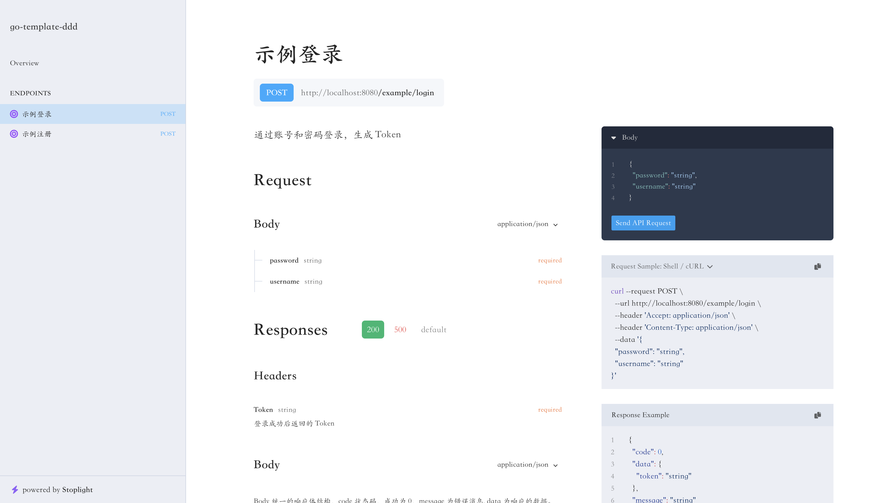
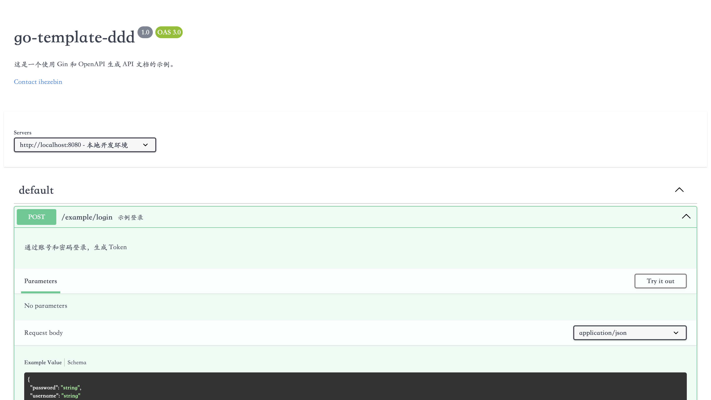
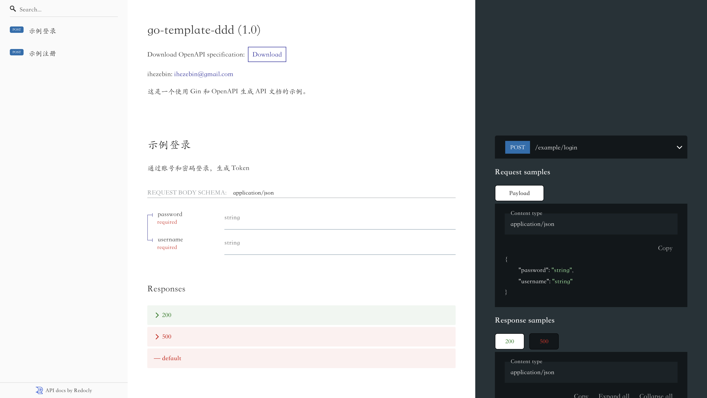
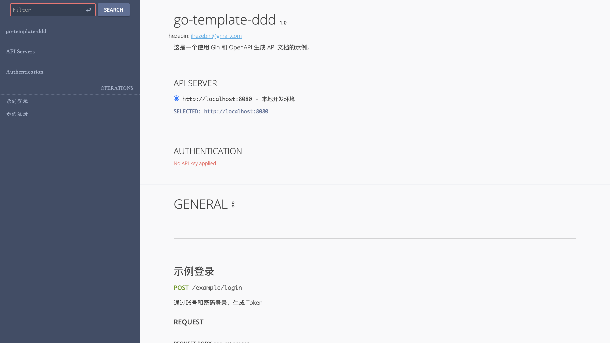

# httpserver

Gin + 编码方式 OpenAPI

## 安装

```bash
go get github.com/ihezebin/httpserver
```

## 示例

```go
package httpserver

import (
	"context"
	"fmt"
	"testing"

	"github.com/getkin/kin-openapi/openapi3"
	"github.com/gin-gonic/gin"
	"github.com/ihezebin/openapi"

	"github.com/ihezebin/httpserver/middleware"
)

var ctx = context.Background()

func TestServer(t *testing.T) {
	server := NewServer(
		WithPort(8000),
		WithServiceName("test_server"),
		WithMiddlewares(
			middleware.Recovery(),
			middleware.LoggingRequestWithoutHeader(),
			middleware.LoggingResponseWithoutHeader(),
		),
		WithOpenAPInfo(openapi3.Info{
			Version:     "1.0",
			Description: "这是一个使用 Gin 和 OpenAPI 生成 API 文档的示例。",
			Contact: &openapi3.Contact{
				Name:  "ihezebin",
				Email: "ihezebin@gmail.com",
			},
		}),
		WithOpenAPIServer(openapi3.Server{
			URL:         fmt.Sprintf("http://localhost:%d", 8000),
			Description: "本地开发环境",
		}),
	)

	server.RegisterRoutes(&HelloRouter{})

	err := server.RegisterOpenAPIUI("/stoplight", StoplightUI)
	if err != nil {
		t.Fatal(err)
	}
	err = server.RegisterOpenAPIUI("/swagger", SwaggerUI)
	if err != nil {
		t.Fatal(err)
	}
	err = server.RegisterOpenAPIUI("/redoc", RedocUI)
	if err != nil {
		t.Fatal(err)
	}
	err = server.RegisterOpenAPIUI("/rapidoc", RapidocUI)
	if err != nil {
		t.Fatal(err)
	}

	if err := server.RunWithNotifySignal(ctx); err != nil {
		t.Fatal(err)
	}
}

type HelloRouter struct {
}

func (h *HelloRouter) RegisterRoutes(router Router) {
	group := router.Group("/hello")
	group.POST("/world", NewHandler(h.Hello))
	group.GET("/ping", NewHandler(h.Ping), WithOpenAPIDeprecated(), WithOpenAPIResponseHeader("Token", openapi.HeaderParam{
		Description: "认证 JWT",
	}))
}

type HelloReq struct {
	Content string `json:"content" form:"content"`
	Id      string `json:"id" form:"id"`
}

// HelloResp 测试的 hello 响应数据
type HelloResp struct {
	Message string `json:"message"`
}

func (h *HelloRouter) Hello(c *gin.Context, req *HelloReq) (resp *HelloResp, err error) {
	return &HelloResp{Message: req.Content}, nil
}

func (h *HelloRouter) Ping(c *gin.Context, req map[string]interface{}) (resp string, err error) {
	fmt.Println(req)
	return "pong", nil
}

```

## OpenAPI UI

### stoplight



### swagger



### redoc



### rapidoc


